# CONTROL DIGITAL - CLASE_4
# Manejo de Simscape Multibody

## Definición  
Simscape Multibody es un entorno de simulación para modelar sistemas en 3D a partir de cuerpos rígidos interconectados mediante articulaciones, como de rotación y prismáticas. Estos mecanismos permiten medir variables de movimiento como fuerza, velocidad, torque y aceleración. Además, se pueden aplicar fuerzas en diferentes puntos del mecanismo y visualizar la animación 3D del movimiento esperado del sistema. Se puede integrar con dominios físicos como hidráulicos, eléctricos y neumáticos. El modelado se realiza mediante bloques y permite importar modelos desde software de modelado CAD.  

## Configuración de Solver  

### Método de Integración  
La efectividad y exactitud del método dependen de la frecuencia de la solución:  

- **Frecuencias altas:** `ode15s`, `ode23s`  
- **Sistemas más típicos:** `ode42`, `ode23`, `ode23t`  

### Paso del Tiempo  
Determina cada cuánto se calculará la integral. Un menor tiempo de paso no siempre es mejor, ya que puede hacer la simulación más lenta y requerir mayor capacidad de procesamiento.  

### Tipo de Paso  
- **Paso variable**  
- **Paso fijo:** Si el tiempo de paso es demasiado pequeño, la simulación puede volverse lenta y exigir mayor capacidad de procesamiento.  

## Primer Proyecto  

Para iniciar un nuevo proyecto, utilizar el comando:  
```matlab
>> smnew
```
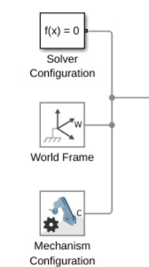

**1 Bloque (solver configuration)**  

-Tolerancia  
-Estado transitorio o estacionario  
-Solver  
-Tiempo de muestreo  
-etc  

**2 Bloque (world frame)**  

parámetros preestablecidos  

**3 Bloque - leyes físicas (mechanism configuration)**  
-Aceleración  
-gravedad - eje z por facilidad se configura en el eje y  
##
### Paso 1

Configurar la gravedad en el eje z  
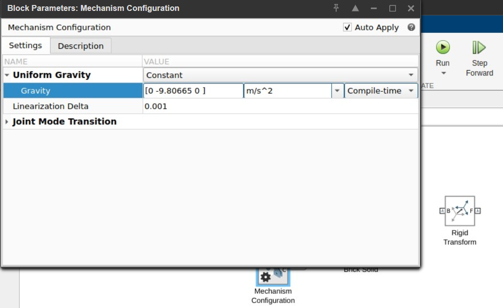
##
### Paso 2
Configurar el tamaño del solido    
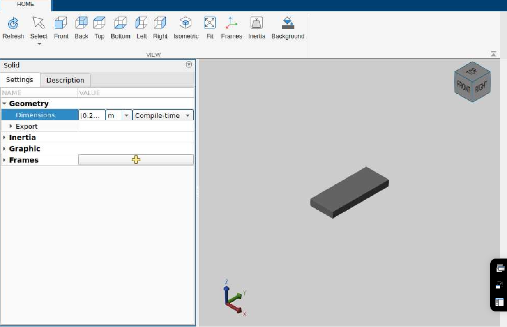
##
### Paso 3
Configurar el color y opacidad del solido   
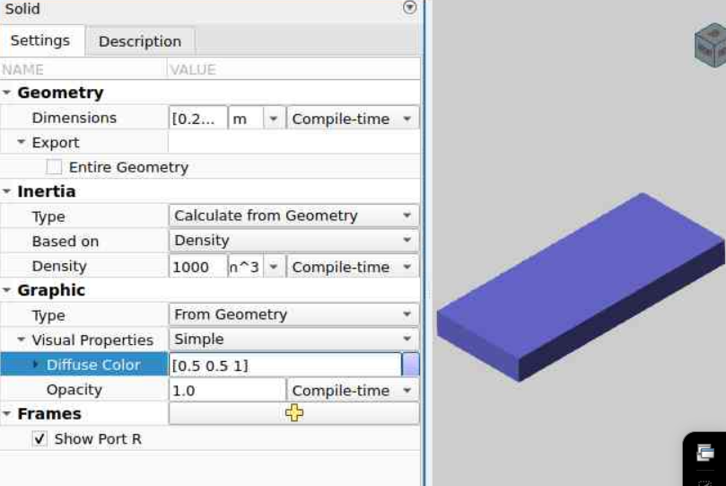
##
### Paso 4
Configurar el frame adicional, el cual posteriormente será usado en la rotación del solido  
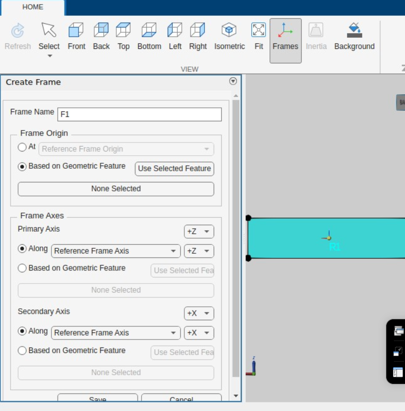
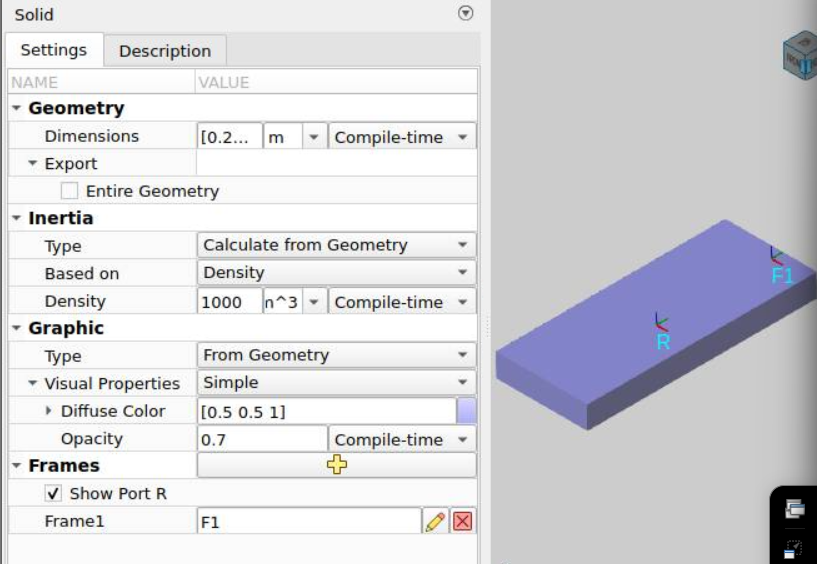
##
### Paso 5
Simular el modelado, el cual se observa en la imagen a continuación
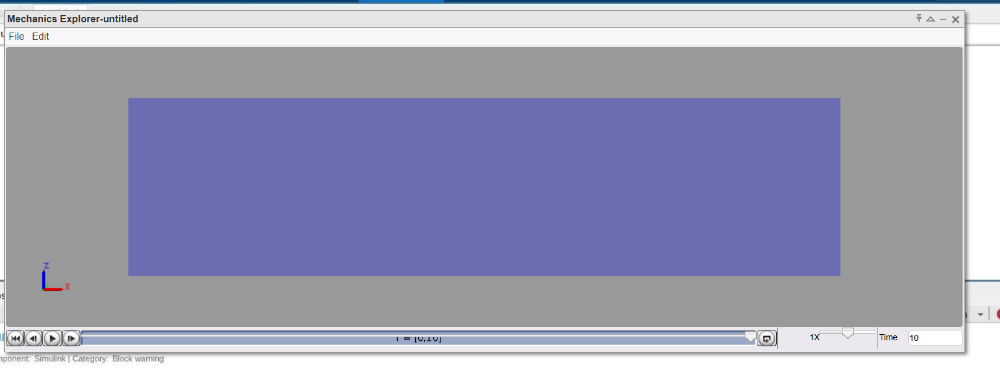
##
### Paso 6
Cambiar la vista de ejes  
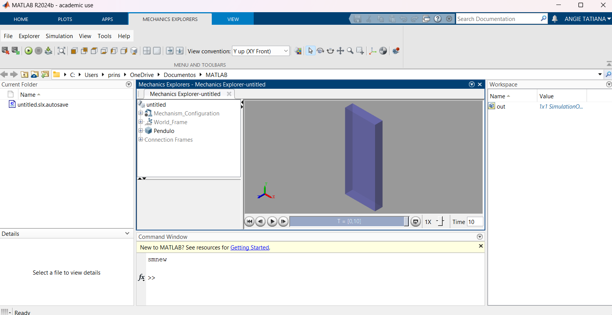
##
### Paso 7
Agregar bloque "Revolute Joint" o Articulación rotaciona : Generan todas las articulaciones.  
B=base  
F=seguidor  
Restricciones: solo permite hacer rotaciones con respecto al eje z
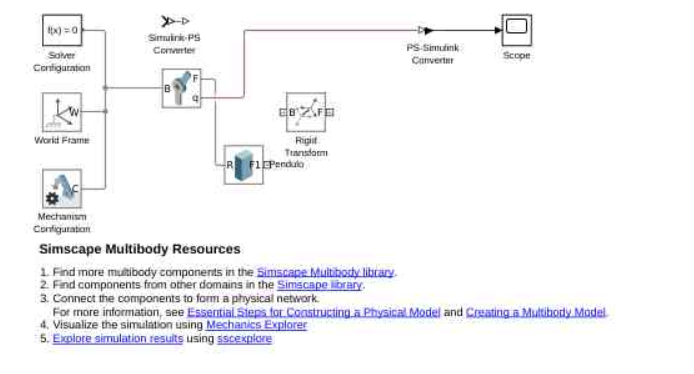
Se puede configurar velocidad y posición inicial y algunas variables mas y mediciones
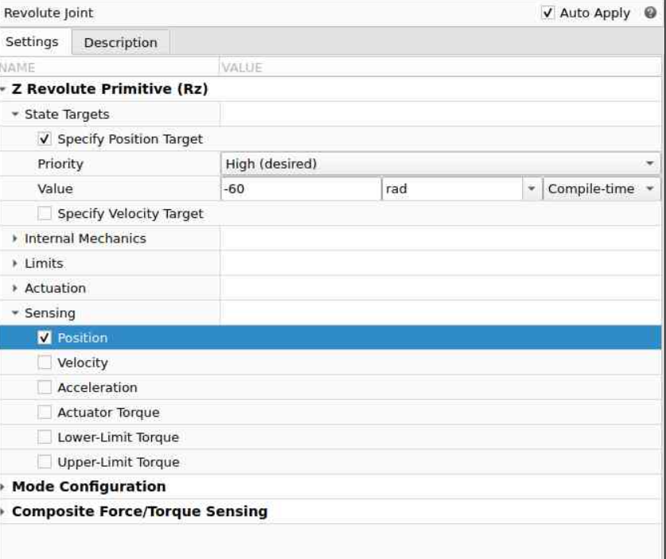
##
### Paso 8
Observar simulación y ver la rotación del solido  
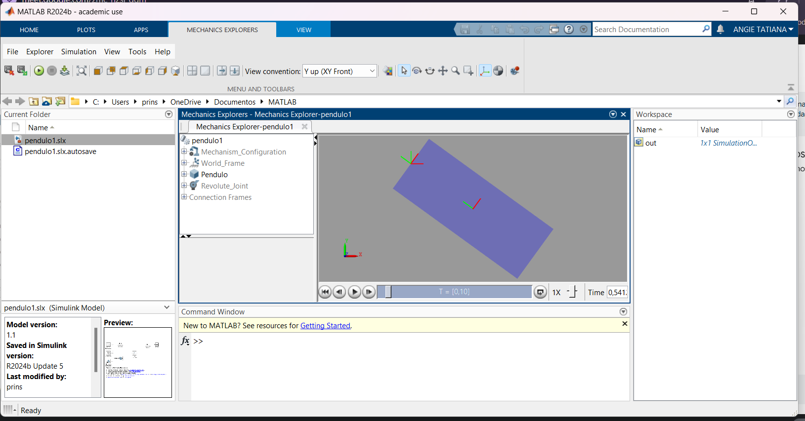
##
### Paso 9
Observar simulación en el osciloscopio   
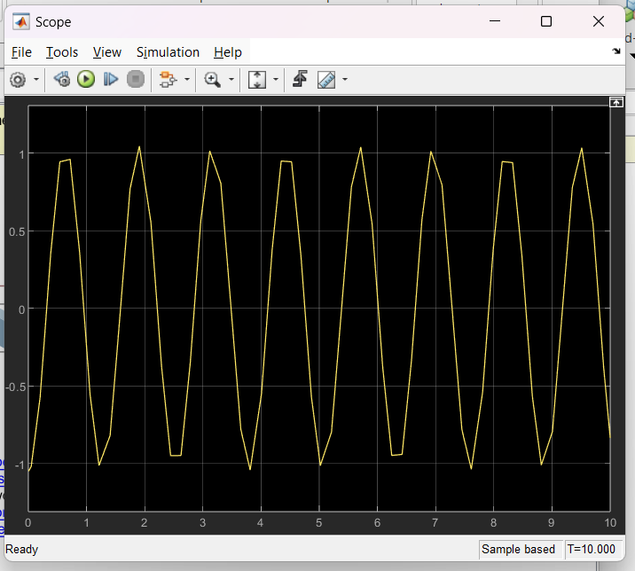
##
##
### Paso 10
Abrir interfaz data inspector
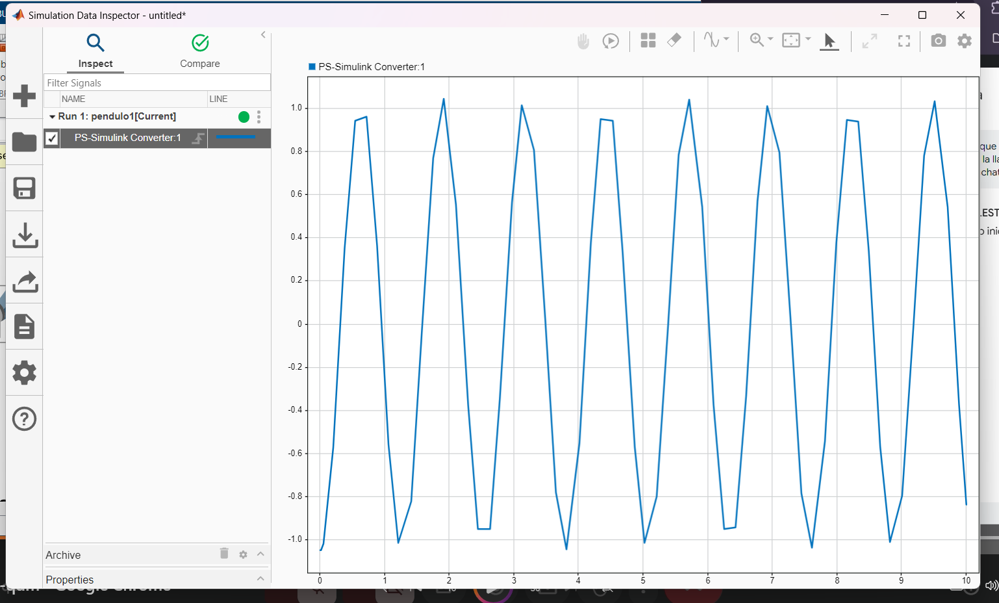
##
### Paso 11
Cambiar parametros de paso fijo y configurar el tiempo
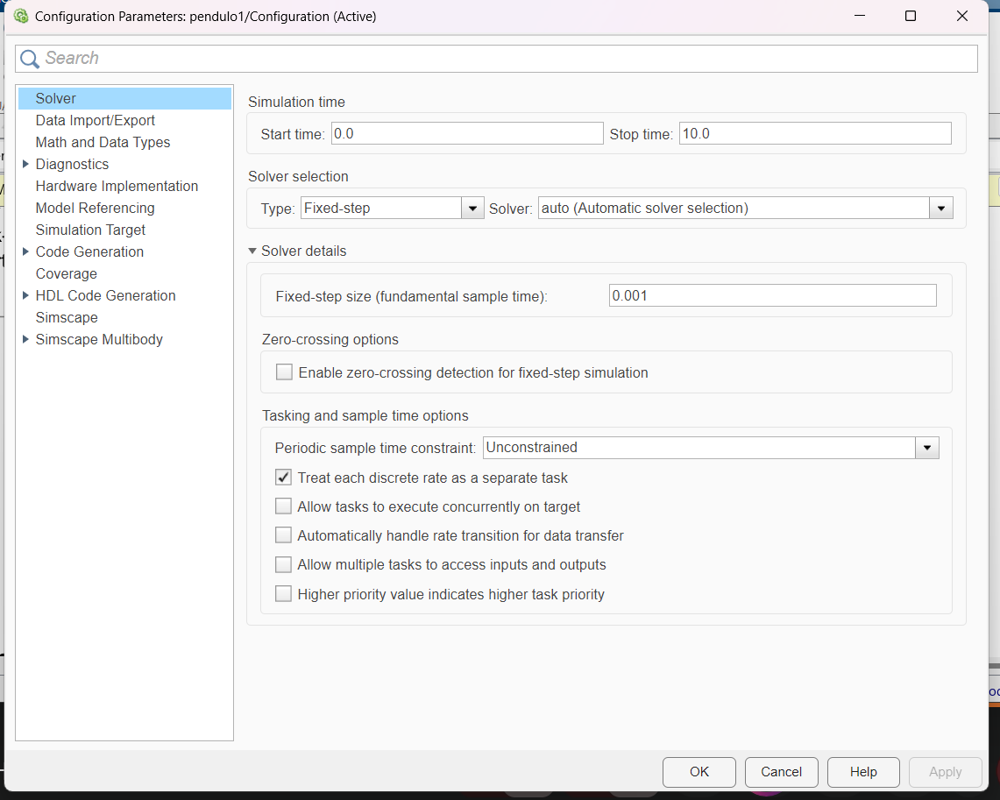
##
### Paso 12
Abrir interfaz data inspector y observar el cambio de la gráfica con los nuevos parámetros
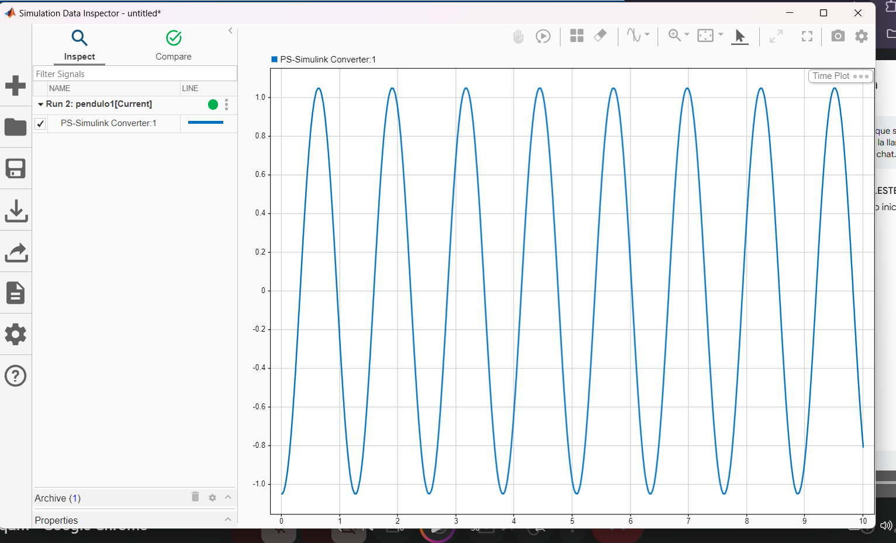
##
### Paso 13
Comparar las señales de paso variable y paso fijo
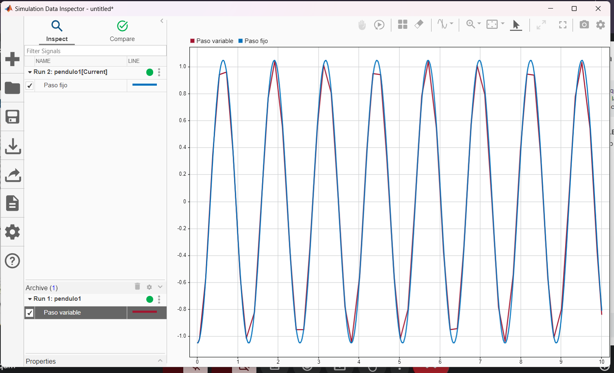
