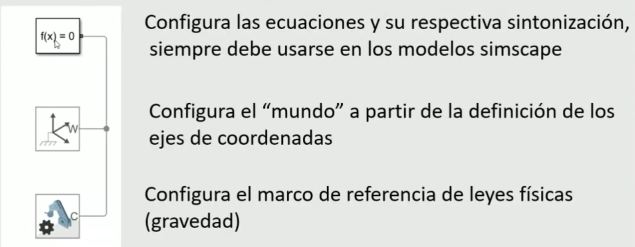

# CONTROL DIGITAL - CLASE_4
# Manejo de Simscape Multibody

## Definición  
Simscape Multibody es un entorno de simulación para modelar sistemas en 3D a partir de cuerpos rígidos interconectados mediante articulaciones, como de rotación y prismáticas. Estos mecanismos permiten medir variables de movimiento como fuerza, velocidad, torque y aceleración. Además, se pueden aplicar fuerzas en diferentes puntos del mecanismo y visualizar la animación 3D del movimiento esperado del sistema. Se puede integrar con dominios físicos como hidráulicos, eléctricos y neumáticos. El modelado se realiza mediante bloques y permite importar modelos desde software de modelado CAD.  

## Configuración de Solver  

### Método de Integración  
La efectividad y exactitud del método dependen de la frecuencia de la solución:  

- **Frecuencias altas:** `ode15s`, `ode23s`  
- **Sistemas más típicos:** `ode42`, `ode23`, `ode23t`  

### Paso del Tiempo  
Determina cada cuánto se calculará la integral. Un menor tiempo de paso no siempre es mejor, ya que puede hacer la simulación más lenta y requerir mayor capacidad de procesamiento.  

### Tipo de Paso  
- **Paso variable**  
- **Paso fijo:** Si el tiempo de paso es demasiado pequeño, la simulación puede volverse lenta y exigir mayor capacidad de procesamiento.  

## Primer Proyecto  

Para iniciar un nuevo proyecto, utilizar el comando:  
```matlab
>> smnew
```


**1 bloque**  

-Tolerancia  
-Estado transitorio o estacionario  
-Solver  
-Tiempo de muestreo  
-etc  

**2 bloque**  

parámetros preestablecidos  

**3 bloque leyes físicas**  
-Aceleración  
-gravedad - eje z por facilidad se configura en el eje y  
